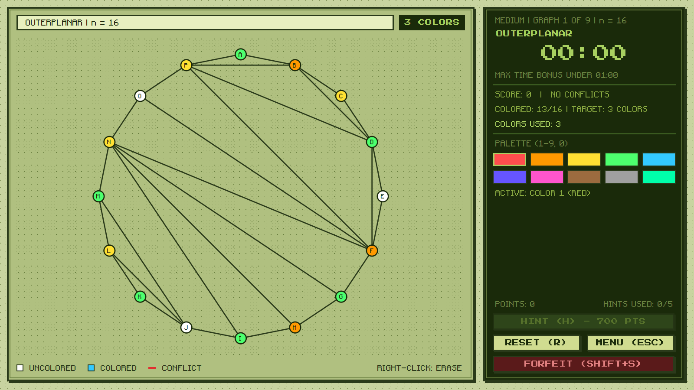
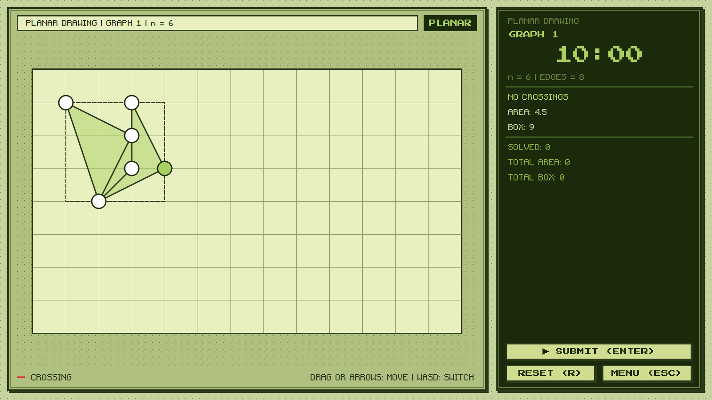

# Graphiti

A pixel-style puzzle game about graphs. Color them, untangle them, or race your friends at both.



## What you do

**Color the graph.** No two connected vertices can share a color, and you try to use as few colors as possible. The game knows the true minimum for every graph, so it can tell you how close you got.

**Untangle the graph.** Slide vertices around on grid paper until no edges cross, then squeeze the drawing into the smallest area you can.



## Modes

- **Standard** - three difficulties, scoring, hints, titles and a leaderboard. Each level needs a bigger graph than the last.
- **Free mode** - practice any of the 11 graph types at any size. No score, free hints.
- **Planar drawing** - a 10-minute run of tangled graphs. Most solved wins, then smallest area.
- **Multiplayer** - up to 20 players on the same Wi-Fi or LAN. Everyone gets the same graphs; the host picks a coloring race or a planar race and how long it lasts.
- **Accessories** - spend the points you bank in Standard on custom cursors and vertex icons.

Everything else (controls, scoring, skip penalties) is explained in the in-game **GUIDE**.

## Play

**Windows:** download `Graphiti.exe` from the [latest release](https://github.com/YaseenK-gh/Graphiti/releases/latest) and run it. Nothing to install.

**From source** (Python 3.10 or newer):

```bash
pip install -r requirements.txt
python main.py
```

For multiplayer, Windows may ask to allow the game through the firewall the first time you host. Say yes, or other players won't see your lobby.

## What's new

**v1.0**

- Planar drawing mode, with its own leaderboard
- Local-network multiplayer: coloring races and planar races
- Accessories shop with saved points
- Host can set the match length (1 to 30 minutes)
- W A S D to jump between vertices in planar drawing
- Background music and a single-file Windows build

Older and newer changes are listed on the [releases page](https://github.com/YaseenK-gh/Graphiti/releases).

## For the curious

Written in Python with PySide6. The code is split into `algorithms/` (graph generation, coloring solvers, the planar engine), `core/` (rules, scoring, saves), `net/` (multiplayer) and `ui/` (everything you see).

```bash
python -m unittest
```

This game was developed by https://github.com/YaseenK-gh with the help of https://github.com/abm64180-bit and https://github.com/rodela-007 .

## License

All rights reserved. You're welcome to play the game and read the code, but not to reuse, redistribute or sell it. Details are in [LICENSE](LICENSE); music, font and library credits are in [CREDITS.md](CREDITS.md).
